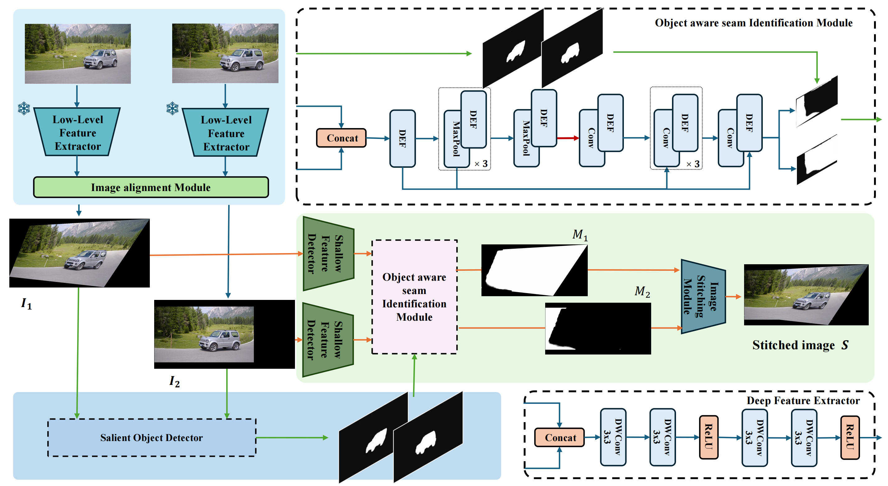

# OAIV-Coherence
Official pytorch implementation of OAIV-Coherence(Enhancing Seam Carving with Object Awareness for Improved Visual Coherence)

## Introduction
Seam carving is a classic topic in computer graphics, playing a crucial role in reducing misalignment caused by differences in captured perspectives and object motion in image stitching. Traditional seam carving methods fail to consider semantic information, resulting in disrupted foreground continuity. We propose a deep learning-based framework that leverages semantic priors of foreground objects, introducing a novel loss function to preserve semantic integrity and enhance visual coherence. Additionally, We propose two specialized real-world datasets to evaluate our method. Experimental results demonstrate significant improvements in image quality, addressing traditional technique limitations and providing robust support for practical applications.

