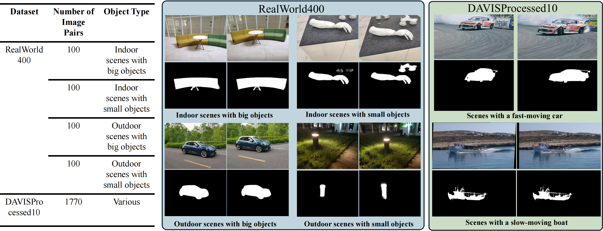

# OAIV-Coherence
Official pytorch implementation of OAIV-Coherence(Enhancing Seam Carving with Object Awareness for Improved Visual Coherence)


## Introduction
Seam carving is a classic topic in computer graphics, playing a crucial role in reducing misalignment caused by differences in captured perspectives and object motion in image stitching. Traditional seam carving methods fail to consider semantic information, resulting in disrupted foreground continuity. We propose a deep learning-based framework that leverages semantic priors of foreground objects, introducing a novel loss function to preserve semantic integrity and enhance visual coherence. Additionally, We propose two specialized real-world datasets to evaluate our method. Experimental results demonstrate significant improvements in image quality, addressing traditional technique limitations and providing robust support for practical applications.

## Preparation

### Install

We implement this work with UWSL2(Ubuntu24.04), 3090, and CUDA11.

1. Git clone this repository.

```
git clone https://github.com/Pokerman8/OAIV-Coherence.git
```

3. Create a new conda environment
  
```
conda env create -f environment.yml
```


### DATASET

### Training set

We trained our network using the unsupervised UDIS-D dataset [1], which consists of 10,440 cases derived from various moving videos, including those from [2] and independently captured scenes.

Download the training set from [Onedrive](https://1drv.ms/u/c/89cf0bfd859af8e2/EW5zJJcidrJFtW4sMSwVaBgBsArnsipWeL9Z92N8YhqiCQ?e=dugcFQ).

### Testing set

we developed two specialized datasets: DAVISProcessed10 and RealWorld400. DAVISProcessed10, generated by selecting the first and last frames from every ten-frame sequence in DAVIS, contains 1,770 image pairs, while RealWorld400 comprises 400 pairs of real-world data(details are shown in the figure below).



A portion of the test set can be downloaded from [this link](https://1drv.ms/u/c/89cf0bfd859af8e2/ES86DDgxt-FNi5iT6_CpgToBlBveoDJvksna1mPYx2Gfdw?e=h1mPvU), and we will release all the test data soon.

## Testing

### test with our pretrain model

## References

1. Lang Nie, Chunyu Lin, Kang Liao, Shuaicheng Liu, and Yao Zhao. "Unsupervised Deep Image Stitching: Reconstructing Stitched Features to Images." IEEE Transactions on Image Processing, vol. 30, pp. 6184-6197, 2021. [doi:10.1109/TIP.2021.3092828](https://doi.org/10.1109/TIP.2021.3092828).

2. Jirong Zhang, Chuan Wang, Shuaicheng Liu, Lanpeng Jia, Nianjin Ye, Jue Wang, Ji Zhou, and Jian Sun. "Content-aware unsupervised deep homography estimation." In *Computer Vision--ECCV 2020: 16th European Conference, Glasgow, UK, August 23--28, 2020, Proceedings, Part I 16*, pp. 653-669. Springer, 2020.
